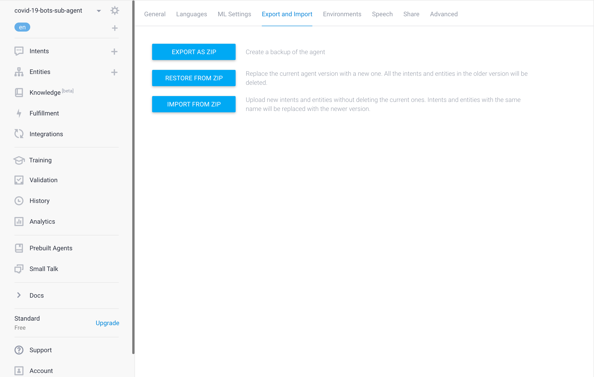
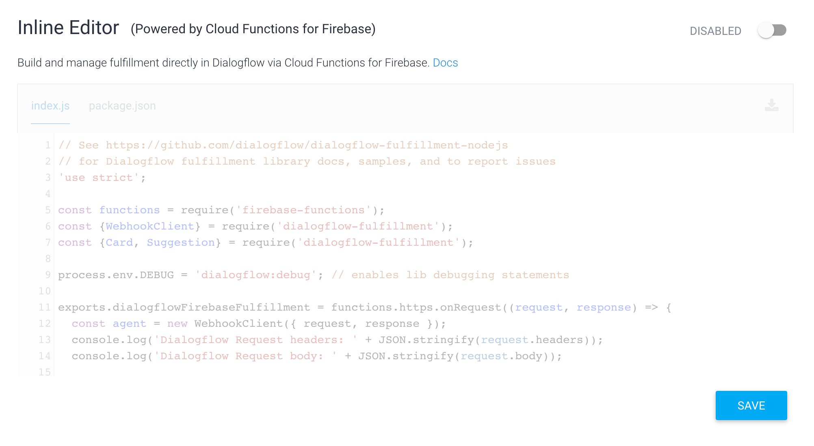
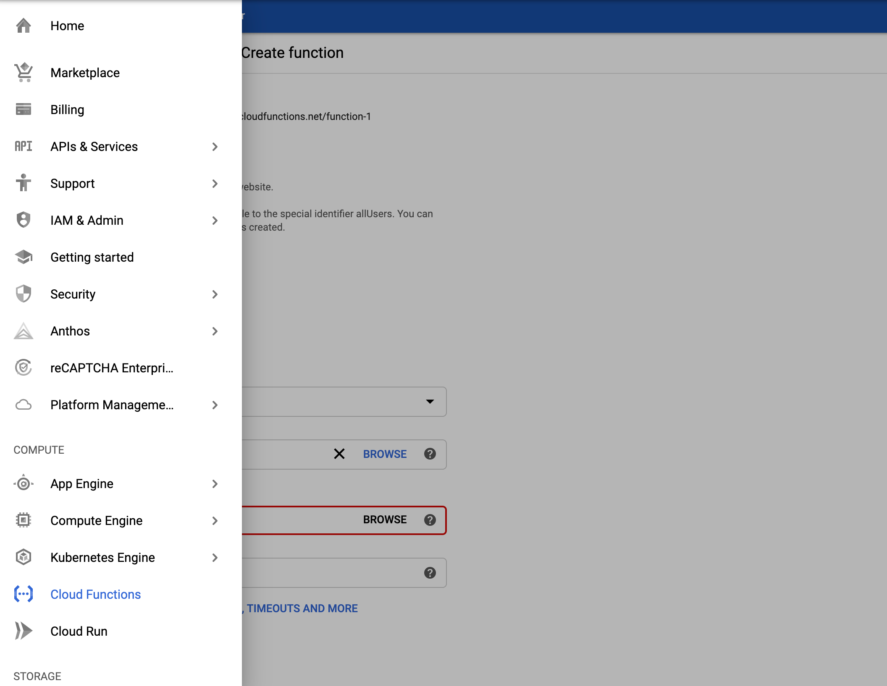
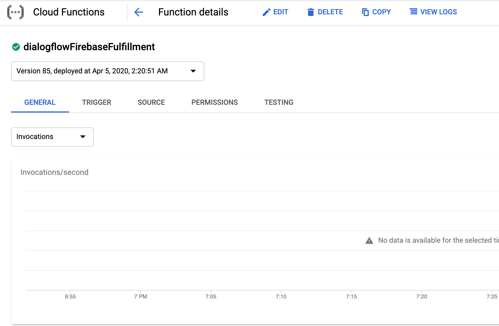
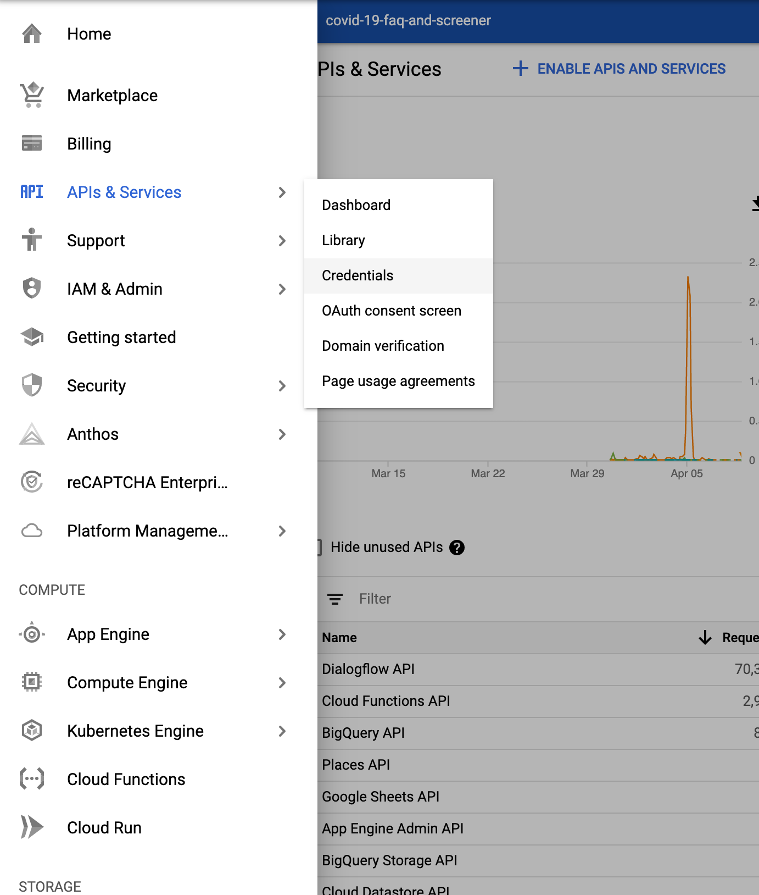
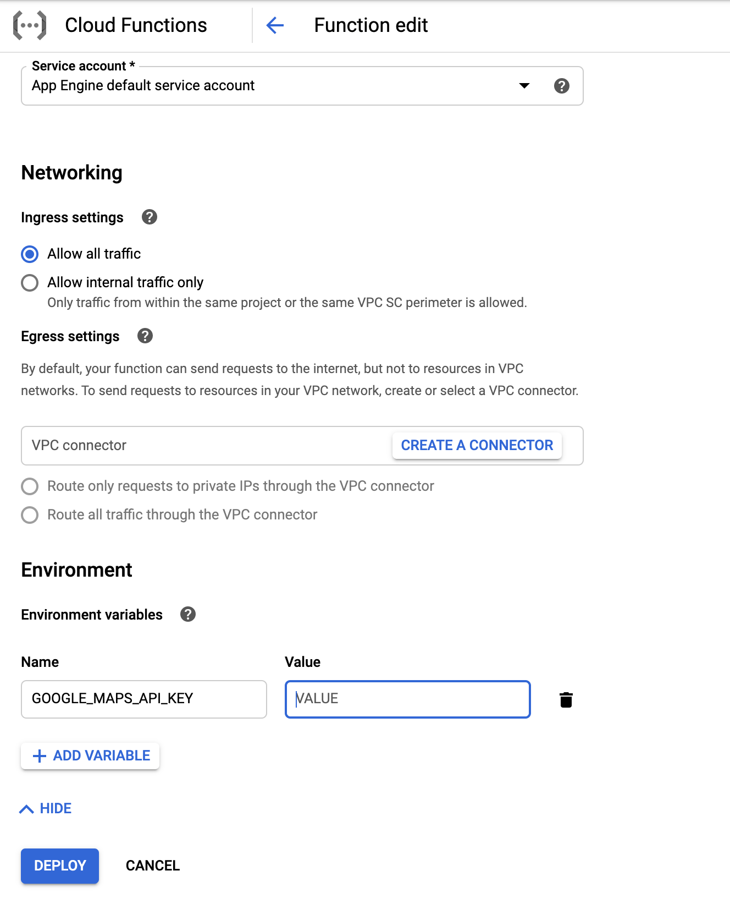
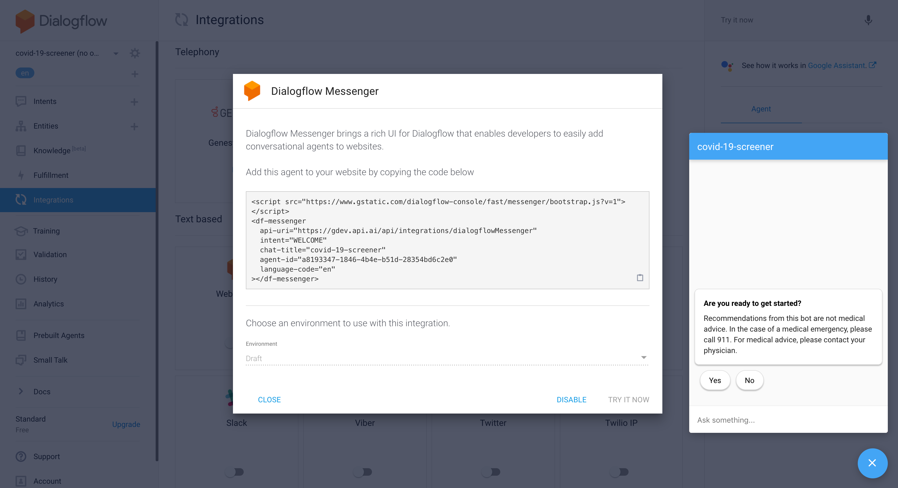

<!--
  Licensed to the Apache Software Foundation (ASF) under one or more
  contributor license agreements.  See the NOTICE file distributed with
  this work for additional information regarding copyright ownership.
  The ASF licenses this file to You under the Apache License, Version 2.0
  (the "License"); you may not use this file except in compliance with
  the License.  You may obtain a copy of the License at

      http://www.apache.org/licenses/LICENSE-2.0

  Unless required by applicable law or agreed to in writing, software
  distributed under the License is distributed on an "AS IS" BASIS,
  WITHOUT WARRANTIES OR CONDITIONS OF ANY KIND, either express or implied.
  See the License for the specific language governing permissions and
  limitations under the License.
-->
# Verily Pathfinder Virtual Agent Template for COVID-19 
Verily, in partnership with Google Cloud, has launched a curated Dialogflow 
template for health systems and hospitals, enabling chat or voice bots to 
answer questions about COVID-19 symptoms and provide the latest guidance from 
public health authorities like the Centers for Disease Control and Prevention 
and World Health Organization (WHO). 

It can:
* Automatically answer frequently asked questions about COVID-19 
* Help users understand possible symptoms and severity
* Guide users to relevant information from public health authorities

You can:
* Launch your bot faster with curated content
* Customize to match your website and add content to address your organization 
and community needs  
* Provide up-to-date information about COVID-19 to your community, which is 
updated regularly by Verily 

Information on COVID-19 changes frequently. Check release dates and review 
content before launching your bot.

## Agent Deployment
Verily provides the [Dialogflow Verily COVID-19 Pathfinder virtual agent 
template (the "Template")](./agent-template/covid-19-agent-template.zip), so you 
can import it into your own agent and make changes to fit your needs.

### Import the Dialogflow Verily COVID-19 Pathfinder Virtual Agent Template into Your Agent
1. Download the [Dialogflow COVID-19 Agent Template](./agent-template/covid-19-agent-template.zip)
1. Create a new agent.
1. Click the Settings icon.
1. Select the Export and Import tab, then click the IMPORT FROM ZIP button to 
import the agent template.

### Import and Deploy Fulfillment into Your Agent
*Please note there are three special intents (coronavirus.closure and coronavirus.confirmed_cases and coronavirus.death) which require you to set up the Google Maps API and BigQuery API. Please follow up step 8-10 to set up the APIs.*
1. Download Fulfillment from [Dialogflow COVID-19 Fulfillment.](./agent-template/dialogflow-fulfillment.zip).
1. Click "Fulfillment" in the left sidebar.
1. Toggle the switch to enable the Inline Editor.
.
1. Follow the instruction on the screen to enable fulfillment via Cloud 
Functions and enable billing for the Cloud project.
1. Go to the Google Cloud Console and select Cloud Functions on the left panel.

1. Select the fulfillment and click Edit button.

1. Under the "Source code" section, select "ZIP upload" and upload the 
fulfillment zip file downloaded at step 1. Then select a Stage bucket (you may need to create one if it hasn't been created yet).
1. [Optional] Follow [Quickstart](https://developers.google.com/maps/gmp-get-started#quickstart) to enable [Google Maps Places API](https://developers.google.com/places/web-service/intro) if you haven't done so. Go to GCP API & Services->Credentials component to creat an API key for calling the Google Maps API (More detailed instructions are listed at [Get an API Key](https://developers.google.com/places/web-service/get-api-key?hl=en_US).

1.  Set GOOGLE_MAPS_API_KEY environment variable to the API key when deploy Cloud Function. (More details can be found at  [Cloud Function Updating Environment Variable](https://cloud.google.com/functions/docs/env-var#updating_environment_variables))

1. [Optional] To use metrics for COVID-19, Enable the [BigQuery API](https://console.cloud.google.com/flows/enableapi?apiid=bigquery) by selecting your project.

## Integrate with Verily Pathfinder Virtual Agent Template for COVID-19

### Interact with the Dialogflow Console
Type your text query input in the Dialogflow Simulator. *Please note that custom payload of response may not show up on Dialogflow Console, you can click DIAGNOSTIC INFO to get more information about the response*.

### Integrate with [Dialogflow Messenger](https://cloud.google.com/dialogflow/docs/integrations/dialogflow-messenger)
1. Go to the Dialogflow Console.
1. Select your agent.
1. Click Integrations in the left sidebar menu.
1. Enable the Dialogflow Messenger integration.
1. Open the agent's web page using the provided link. This page provides a text 
chat interface. Type your input query and press enter. The agent responds with 
the response from your agent.

1. [Optional] You may also embed the Dialogflow Messenger into your website by 
following the instructions.

### Integrate with this Chat App
This chat application provides a front end chat interface to a Dialogflow Agent. 
*Please note this chat app not an official Google product.* 

### Integrate with Twilio to provide the agent over SMS [optional]
You can deploy a Twilio to Dialogflow "bridge" running serverless Cloud Run to expose your agent over SMS. See the [these instructions](./twilio-sms).

#### Requirements
* A GCP Project with existing Dialogflow Agent setup in a project we'll refer 
to as `PROJECTDIALOGFLOW`
* A second GCP project that will host this application using AppEngine we'll 
refer to as `PROJECTAPPENGINE`
* You must login to gcloud as a user that has access to both projects.
* Install gcloud SDK
* Install node.js
* Install make

##### Requirements for development
* run `npm install -g @angular/cli`

#### Setup
* In `/Makefile` set `PROJECTDIALOGFLOW` and `PROJECTAPPENGINE` 
* In `/server/app.yaml` Set `PROJECTDIALOGFLOW`
* Run `make init` 
* To develop, you will need a need a service account and credentials. To do 
this run `make serviceaccount`

##### Explanation
Running `make init` will do the following:
* Enable API access on `PROJECTAPPENGINE`
* Intialize AppEngine on `PROJECTAPPENGINE`
* Enable Cloud Run service account to deploy to AppEngine on `PROJECTAPPENGINE`
* Enable AppEngine on `PROJECTAPPENGINE` service account to call Dialogflow 
on `PROJECTDIALOGFLOW`  
* Create service account for Dialogflow   
* Grant service account access to `PROJECTDIALOGFLOW`
* Download key for service account. 
* Install node_modules. 
* Create Angular builder for Cloud Build 

#### To Develop
* Run `export GOOGLE_APPLICATION_CREDENTIALS=[replace with the path to this app]/creds/creds.json`
* Run `make dev`

#### To Deploy
* Run `make deploy`

### Interaction with Dialogflow API
You can follow this [quick start](https://cloud.google.com/dialogflow/docs/quick/api) to interact with your agent using Dialogflow API.
 
### Integrate Your Agent with Text-based Third-Party Conversation Platform
Dialogflow has integrated with various text-based conversation platforms such 
as Facebook, Telegram, Line, Slack, etc. You can follow instructions at 
[Integration Page](https://cloud.google.com/dialogflow/docs/integrations) to 
set up an integration for each platform.

### Integrate with Dialogflow phone Gateway
Dialogflow provides a one-click integration for a telephone interface to your 
agent by selecting a phone number hosted by Google. See our 
[documentation](https://cloud.google.com/dialogflow/docs/integrations/phone-gateway) 
for detailed instructions. Please note that if you expect your virtual agent to 
have a high call volume, request a toll-free phone number during the set up.

## Verily COVID-19 Pathfinder virtual agent template
### Terms of Use 
The Verily COVID-19 Pathfinder virtual agent template (this "Template") and 
accompanying integration guide is provided by Verily Life Sciences LLC 
(in "/agent-template/" of this repository). By downloading, accessing or using 
the Verily COVID-19 Pathfinder virtual agent template you acknowledge and agree 
that you are authorized to accept these terms and conditions applicable to the 
Template on behalf of the individual or entity that will be using this Template 
and will communicate these terms and conditions to all users of the Template for 
compliance. You acknowledge and agree that the information in the Template does 
not contain or constitute medical advice and only contains guidance from 
publicly accepted, publicly available sources, such as the Centers for Disease 
Control and Prevention, the World Health Organization, Johns Hopkins, the 
American Heart Association, the American Diabetes Association, and the American 
Lung Association.  The Template was designed for U.S. audiences. Prior to using 
the content of the Template, you are responsible for reviewing and approving 
each of the responses within the Template and will only provide the content to 
your web service users if you approve of the content. The Template by Verily 
Life Sciences LLC is subject to copyright and licensed to you under the [CC-BY 
4.0 License](/agent-template/LICENSE) (a.k.a., the "Creative Commons Attribution 
4.0 International Public License") including the disclaimer of warranties 
therein. Your use of this Template indicates your acceptance of all of the above 
stated and referenced terms and conditions. If you have a concern related to the 
content of the Template you can contact the Verily Life Sciences LLC support 
team via the following email address: 
[covid19pathfinder@verily.com](mailto:covid19pathfinder@verily.com)

Verily COVID-19 Pathfinder virtual agent template ("Template") versions:
* Version 2.0.0 is available at commit 1d61e4672fa24eb2cec1083c69b00fba255dd6f9, 
released on April 7, 2020 based on information locked on April 4, 2020. 
* Version 3.0.0 is available at commit a9019b290c9d5f9cb006d3422f87a8dfdf4dfb10, 
released on April 10, 2020 based on information locked on April 4, 2020. 
* Version 3.1.0 is available at commit cd4738b899644ee4643a67c07dcd461d308a4ed1,
released on April 11, 2020 based on information locked on April 7, 2020.
* Version 3.2.0 is available at commit 1713158df677c34cb5adc200cc1bc9aa9cdf23af,
released on April 17, 2020 based on information locked on April 14, 2020.
* Version 4.0.0 is available at commit d99e6e28e543dd557846dd89a40b5893a6102523,
released on April 28, 2020 based on information locked on April 20, 2020.
* Version 4.1.0 is available at commit da7989b37bd38703248f2dd6f815402805d8201b,
released on May 7, 2020 based on information locked on April 27, 2020.
* Version 4.2.0 is available at commit ee049824a12ed9f1bca1b1008bc3b31c5b8ee9ef
released on May 13, 2020 based on information locked on May 8, 2020.
* Version 4.3.0 is available at commit 7ea18963a54271e697b4c484bb3bfacb332219b2
released on Jun 5, 2020 based on information locked on May 26, 2020.

### User Guide
[USER_GUIDE.pdf](/agent-template/USER_GUIDE.pdf)

### Release Notes
[RELEASE_NOTES.pdf](/agent-template/RELEASE_NOTES.pdf)

## Google Cloud Disclaimer: 
The contents of this GitHub directory (except for Verily's directory 
/agent-template/ as referenced above) are provided under the Apache 2.0 license. 
The information in these files is for information use only and does not contain 
or constitute medical advice; it contains references to and integration guidance 
for the Verily COVID-19 Pathfinder virtual agent template.  Any implementation 
of Verily COVID-19 Pathfinder virtual agent template and the information 
contained therein may not be accurate, consistent and/or up-to-date. 
