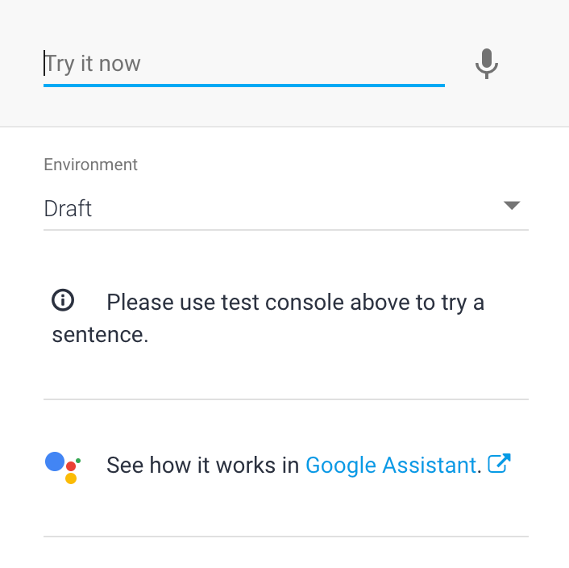

<!--
  Licensed to the Apache Software Foundation (ASF) under one or more
  contributor license agreements.  See the NOTICE file distributed with
  this work for additional information regarding copyright ownership.
  The ASF licenses this file to You under the Apache License, Version 2.0
  (the "License"); you may not use this file except in compliance with
  the License.  You may obtain a copy of the License at

      http://www.apache.org/licenses/LICENSE-2.0

  Unless required by applicable law or agreed to in writing, software
  distributed under the License is distributed on an "AS IS" BASIS,
  WITHOUT WARRANTIES OR CONDITIONS OF ANY KIND, either express or implied.
  See the License for the specific language governing permissions and
  limitations under the License.
-->

# Agent Deployment
Dialogflow provides the [Dialogflow COVID-19 Agent Template](./agent-template/covid-19-agent-template.zip), so you can import it into your own agent and make changes to fit your needs.

## Import the Dialogflow COVID-19 Agent Template into Your Agent
1. Download the [Dialogflow COVID-19 Agent Template](./agent-template/covid-19-agent-template.zip)
1. Create a new agent.
1. Click the Settings icon.
1. Select the Export and Import tab, then click the IMPORT FROM ZIP button to import the agent template.

## Import and Deploy Fulfillment into Your Agent
*Please note there are three special intents (coronavirus.closure and coronavirus.confirmed_cases and coronavirus.death) which require you to set up the Google Maps API and BigQuery API. Please follow up step 7 and 8 to set up the APIs.*
1. Download Fulfillment from [Dialogflow COVID-19 Fulfillment](./agent-template/dialogflow-fulfillment.zip).
1. Click "Fulfillment" in the left sidebar.
1. Toggle the switch to enable the Inline Editor.
.
1. Follow the instruction on the screen to enable fulfillment via Cloud Functions and enable billing for the Cloud project.
1. Go to the Google Cloud Console and select Cloud Functions on the left panel.

1. Under the "Source code" section, select "ZIP upload" and upload the fulfillment zip file downloaded at step 1.
1. [Optional] Follow instructions at [Get an API Key](https://developers.google.com/places/web-service/get-api-key?hl=en_US) to get an API key for calling the Google Maps API. And then follow [Cloud Function Updating Environment Variable](https://cloud.google.com/functions/docs/env-var#updating_environment_variables) to set GOOGLE_MAPS_API_KEY environment variable to the API key.
1. [Optional] To use metrics for COVID-19, Enable the [BigQuery API](https://console.cloud.google.com/flows/enableapi?apiid=bigquery) by selecting your project.

# Integrate with Your Dialogflow Agent

## Interact with the Dialogflow Console
Type your text query input in the Dialogflow Simulator. *Please note that custom payload of response may not show up on Dialogflow Console, you can click DIAGNOSTIC INFO to get more information about the response*.

## Integrate with [Dialogflow Messenger](https://cloud.google.com/dialogflow/docs/integrations/dialogflow-messenger)
1. Go to the Dialogflow Console.
1. Select your agent.
1. Click Integrations in the left sidebar menu.
1. Enable the Dialogflow Messenger integration.
1. Open the agent's web page using the provided link. This page provides a text chat interface. Type your input query and press enter. The agent responds with the response from your agent.

1. [Optional] You may also embed the Dialogflow Messenger into your website by following the instructions.

## Integrate with this Chat App
This chat application provides a front end chat interface to a Dialogflow Agent. *Please note this chat app not an official Google product.* 

### Requirements
* A GCP Project with existing Dialogflow Agent setup in a project we'll refer to as `PROJECTDIALOGFLOW`
* A second GCP project that will host this application using AppEngine we'll refer to as `PROJECTAPPENGINE`
* You must login to gcloud as a user that has access to both projects.

### Requirements for development
* Install gcloud SDK
* Install node.js
* run `npm install -g @angular/cli`

### Setup
* In `/Makefile` set `PROJECTDIALOGFLOW` and `PROJECTAPPENGINE` 
* In `/server/app.yaml` Set `PROJECTDIALOGFLOW`
* Run `make init` 
* To develop, you will need a need a service account and credentials. To do 
this run `make serviceaccount`

#### Explanation
Running `make init` will do the following:
* Enable API access on `PROJECTAPPENGINE`
* Intialize AppEngine on `PROJECTAPPENGINE`
* Enable Cloud Run service account to deploy to AppEngine on `PROJECTAPPENGINE`
* Enable AppEngine on `PROJECTAPPENGINE` service account to call Dialogflow 
on `PROJECTDIALOGFLOW`  
* Create service account for Dialogflow   
* Grant service account access to `PROJECTDIALOGFLOW`
* Download key for service account. 
* Install node_modules. 
* Create Angular builder for Cloud Build 

### To Develop
* Run `make dev`

## Interaction with Dialogflow API
You can follow this [quick start](https://cloud.google.com/dialogflow/docs/quick/api) to interact with your agent using Dialogflow API.
 
## Integrate Your Agent with Text-based Third-Party Conversation Platform
Dialogflow has integrated with various text-based conversation platforms such as Facebook, Telegram, Line, Slack, etc. You can follow instructions at [Integration Page](https://cloud.google.com/dialogflow/docs/integrations) to set up an integration for each platform.

## Integrate with Dialogflow phone Gateway
Dialogflow provides a one-click integration for a telephone interface to your agent by selecting a phone number hosted by Google. See our [documentation](https://cloud.google.com/dialogflow/docs/integrations/phone-gateway) for detailed instructions. Please note that if you expect your virtual agent to have a high call volume, request a toll-free phone number during the set up.
